# 🚀 Falcon 9 First Stage Landing Prediction
## Lab 1: Data Collection via SpaceX API — Notebook Flowchart

This document visualizes the logic flow of the **Falcon 9 API Data Collection Jupyter Notebook**, which retrieves historical launch records from the SpaceX REST API, enriches them with additional API lookups, and produces a clean dataset for downstream analysis.

> **Source:** [SpaceX API v4](https://api.spacexdata.com/v4/launches/past) · Static snapshot hosted on IBM Cloud Object Storage

---

## 📊 Flowchart

```mermaid
flowchart TD
    A([🚀 START: Falcon 9 API Data Collection]) --> B

    subgraph SETUP ["⚙️ SETUP"]
        B[Import libraries\nrequests · pandas · numpy · datetime] --> C
        C[Define helper functions\ngetBoosterVersion · getLaunchSite\ngetPayloadData · getCoreData] --> D
        D[Initialise global lists\nBoosterVersion · PayloadMass · Orbit\nLaunchSite · Outcome · Flights\nGridFins · Reused · Legs · LandingPad\nBlock · ReusedCount · Serial\nLongitude · Latitude]
    end

    D --> T1

    subgraph TASK1 ["📡 TASK 1 — Request & Parse SpaceX Launch Data"]
        T1[GET static JSON snapshot\nIBM Cloud Object Storage URL] --> T1B
        T1B{Status code\n== 200?}
        T1B -- Yes --> T1C[Parse JSON response\nresponse.json]
        T1B -- No --> T1ERR[❌ Handle request error]
        T1C --> T1D[Normalise to DataFrame\npd.json_normalize launches]
        T1D --> T1E[Subset columns\nrocket · payloads · launchpad\ncores · flight_number · date_utc]
        T1E --> T1F[Filter rows\nkeep single-core & single-payload only]
        T1F --> T1G[Unwrap list columns\ncores & payloads → scalar values]
        T1G --> T1H[Parse & filter dates\nkeep launches ≤ 2020-11-13]
    end

    T1H --> T1I

    subgraph ENRICH ["🔗 API ENRICHMENT — Secondary Lookups"]
        T1I[getBoosterVersion\nGET /v4/rockets per rocket ID\n→ BoosterVersion list] --> T1J
        T1J[getLaunchSite\nGET /v4/launchpads per launchpad ID\n→ LaunchSite · Latitude · Longitude] --> T1K
        T1K[getPayloadData\nGET /v4/payloads per payload ID\n→ PayloadMass · Orbit] --> T1L
        T1L[getCoreData\nGET /v4/cores per core ID\n→ Block · ReusedCount · Serial\nOutcome · Flights · GridFins\nReused · Legs · LandingPad]
    end

    T1L --> T1M

    subgraph BUILD ["🗃️ BUILD DATAFRAME"]
        T1M[Assemble launch_dict\nfrom all global lists] --> T1N
        T1N[Create Pandas DataFrame\ndf = pd.DataFrame launch_dict]
    end

    T1N --> T2

    subgraph TASK2 ["🔍 TASK 2 — Filter Falcon 9 Launches Only"]
        T2[Filter df\nBoosterVersion == 'Falcon 9'\n→ data_falcon9] --> T2B
        T2B[Reset FlightNumber\nrange 1 to N]
    end

    T2B --> T3

    subgraph TASK3 ["🧹 TASK 3 — Data Wrangling & Missing Values"]
        T3[Inspect nulls\ndata_falcon9.isnull.sum] --> T3B
        T3B{Missing values\nin PayloadMass?}
        T3B -- Yes --> T3C[Compute mean PayloadMass\ndata_falcon9 PayloadMass .mean]
        T3C --> T3D[Impute NaN with mean\n.replace np.nan with mean]
        T3B -- No --> T3E
        T3D --> T3E[LandingPad None values\nretained intentionally]
    end

    T3E --> OUT

    subgraph OUTPUT ["📊 OUTPUT"]
        OUT[Export clean dataset\ndataset_part_1.csv]
    end

    OUT --> END([✅ END: dataset_part_1.csv ready\nfor EDA & ML labs])

    style SETUP   fill:#e8f4fd,stroke:#2980b9,color:#000
    style TASK1   fill:#eafaf1,stroke:#27ae60,color:#000
    style ENRICH  fill:#fef9e7,stroke:#f39c12,color:#000
    style BUILD   fill:#fdf2f8,stroke:#8e44ad,color:#000
    style TASK2   fill:#eafaf1,stroke:#27ae60,color:#000
    style TASK3   fill:#fef9e7,stroke:#f39c12,color:#000
    style OUTPUT  fill:#fdedec,stroke:#e74c3c,color:#000
```

---

## 📋 Section Summary

| Section | Description |
|---|---|
| ⚙️ **Setup** | Import libraries, define four API helper functions, initialise global data lists |
| 📡 **Task 1** | GET static JSON snapshot → normalise → subset & filter columns → parse dates |
| 🔗 **API Enrichment** | Four secondary API calls per row to retrieve booster, launch site, payload and core details |
| 🗃️ **Build DataFrame** | Assemble `launch_dict` from all enriched lists and convert to a Pandas DataFrame |
| 🔍 **Task 2** | Filter out Falcon 1 entries, keep only Falcon 9 launches, reset flight numbers |
| 🧹 **Task 3** | Detect missing values → impute `PayloadMass` with column mean → retain `LandingPad` nulls |
| 📊 **Output** | Export final clean dataset to `dataset_part_1.csv` |

---

## 🛠️ Tech Stack

- **Python** — `requests`, `pandas`, `numpy`, `datetime`
- **SpaceX REST API v4** — `/rockets`, `/launchpads`, `/payloads`, `/cores`
- **IBM Cloud Object Storage** — Static JSON snapshot for reproducibility

---

*Part of the IBM Data Science Professional Certificate — SpaceX Capstone Project.*
