# 🚀 Falcon 9 First Stage Landing Prediction
## Web Scraping — Notebook Flowchart

This document visualizes the logic flow of the **Falcon 9 Web Scraping Jupyter Notebook**, which collects historical launch records from Wikipedia using `BeautifulSoup` and `requests`.

> **Source:** [List of Falcon 9 and Falcon Heavy launches](https://en.wikipedia.org/w/index.php?title=List_of_Falcon_9_and_Falcon_Heavy_launches&oldid=1027686922) *(Wikipedia snapshot — June 9, 2021)*

---

## 📊 Flowchart

```mermaid
flowchart TD
    A([🚀 START: Falcon 9 Web Scraping Lab]) --> B

    subgraph SETUP ["⚙️ SETUP"]
        B[Install packages\nbeautifulsoup4 · requests] --> C
        C[Import libraries\nrequests · BeautifulSoup · re\nunicodedata · pandas] --> D
        D[Define helper functions\ndate_time · booster_version\nlanding_status · get_mass\nextract_column_from_header]
    end

    D --> T1

    subgraph TASK1 ["📡 TASK 1 — Fetch the Wikipedia Page"]
        T1[Define static_url\nWikipedia snapshot Jun 9 2021] --> T1B
        T1B[HTTP GET request\nrequests.get with headers] --> T1C
        T1C{Response OK?}
        T1C -- Yes --> T1D[Parse HTML with BeautifulSoup\nhtml.parser]
        T1C -- No --> T1E[❌ Handle request error]
        T1D --> T1F[Verify: print soup.title]
    end

    T1F --> T2

    subgraph TASK2 ["🔍 TASK 2 — Extract Column Names"]
        T2[Find all tables\nsoup.find_all 'table'] --> T2B
        T2B[Select 3rd table\nfirst_launch_table = html_tables index 2] --> T2C
        T2C[Find all th header elements] --> T2D
        T2D[Loop through each th\napply extract_column_from_header] --> T2E
        T2E{Name valid &\nnon-empty?}
        T2E -- Yes --> T2F[Append to column_names list]
        T2E -- No --> T2D
        T2F --> T2G[✅ column_names ready\nFlight No · Launch site · Payload\nPayload mass · Orbit · Customer\nLaunch outcome · Booster landing]
    end

    T2G --> T3

    subgraph TASK3 ["🗃️ TASK 3 — Parse Tables & Build DataFrame"]
        T3[Initialize launch_dict\nwith empty lists for each column] --> T3B
        T3B[Find all wikitable\nplainrowheaders collapsible tables] --> T3C

        T3C[Iterate over each table row] --> T3D
        T3D{Row has\nth scope=col?}
        T3D -- Yes: header row --> T3C
        T3D -- No --> T3E{Enough td\ncells ≥ 9?}
        T3E -- No --> T3C
        T3E -- Yes --> T3F[Extract flight number\nfrom th scope=row]

        T3F --> T3G[Extract fields from td cells\nDate · Version Booster · Launch Site\nPayload · Payload Mass · Orbit\nCustomer · Launch Outcome · Booster Landing]

        T3G --> T3H[Append all fields\ninto launch_dict lists]
        T3H --> T3C
    end

    T3H --> T4

    subgraph OUTPUT ["📊 OUTPUT"]
        T4[Create Pandas DataFrame\nfrom launch_dict] --> T5
        T5[Export to CSV files\nspacex_web_scraped_eng.csv\nspacex_web_scraped_esp.csv]
    end

    T5 --> END([✅ END: Dataset ready\nfor next lab])

    style SETUP fill:#e8f4fd,stroke:#2980b9,color:#000
    style TASK1 fill:#eafaf1,stroke:#27ae60,color:#000
    style TASK2 fill:#fef9e7,stroke:#f39c12,color:#000
    style TASK3 fill:#fdf2f8,stroke:#8e44ad,color:#000
    style OUTPUT fill:#fdedec,stroke:#e74c3c,color:#000
```

---

## 📋 Section Summary

| Section | Description |
|---|---|
| ⚙️ **Setup** | Install `beautifulsoup4` & `requests`, import libraries, define helper functions |
| 📡 **Task 1** | HTTP GET request to the Wikipedia snapshot → parse HTML with BeautifulSoup |
| 🔍 **Task 2** | Locate the target HTML table and extract all column names from `<th>` headers |
| 🗃️ **Task 3** | Iterate over table rows, validate data, and populate `launch_dict` field by field |
| 📊 **Output** | Build a Pandas DataFrame and export to `spacex_web_scraped_eng.csv` / `_esp.csv` |

---

## 🛠️ Tech Stack

- **Python** — `requests`, `pandas`, `re`, `unicodedata`
- **BeautifulSoup 4** — HTML parsing
- **Wikipedia** — Data source (static snapshot)

---

*Part of the IBM Data Science Professional Certificate — SpaceX Capstone Project.*
