# 🚀 Falcon 9 First Stage Landing Prediction
## Lab 2: Data Wrangling — Notebook Flowchart

This document visualizes the logic flow of the **Falcon 9 Data Wrangling Jupyter Notebook**, which performs exploratory data analysis on the dataset produced in Lab 1 and generates the binary training label (`Class`) used by all downstream machine learning models.

> **Source dataset:** `dataset_part_1.csv` — IBM Cloud Object Storage

---

## 📊 Flowchart

```mermaid
flowchart TD
    A([🚀 START: Falcon 9 Data Wrangling]) --> B

    subgraph SETUP ["⚙️ SETUP"]
        B[Install & import libraries\npandas · numpy] --> C
        C[Load dataset\npd.read_csv dataset_part_1.csv]
    end

    C --> T1

    subgraph TASK1 ["📡 TASK 1 — Launch Site Analysis"]
        T1[Inspect missing values\ndf.isnull.sum / len df * 100] --> T1B
        T1B[Identify column types\ndf.dtypes] --> T1C
        T1C[Count launches per site\ndf LaunchSite .value_counts\nCCSFS · VAFB SLC-4E · KSC LC-39A]
    end

    T1C --> T2

    subgraph TASK2 ["🔍 TASK 2 — Orbit Distribution"]
        T2[Exclude transfer orbit GTO\ndf Orbit where Orbit != GTO] --> T2B
        T2B[Count orbit occurrences\n.value_counts] --> T2C
        T2C[Compute relative frequency\n.value_counts normalize=True\nLEO · VLEO · ISS · SSO\nGEO · MEO · HEO · PO · ES-L1]
    end

    T2C --> T3

    subgraph TASK3 ["🗃️ TASK 3 — Mission Outcome Analysis"]
        T3[Count outcome occurrences\nlanding_outcomes = df Outcome\n.value_counts] --> T3B
        T3B[Compute outcome percentages\n.value_counts normalize=True * 100] --> T3C
        T3C[Enumerate outcome keys\nTrue·False ASDS\nTrue·False RTLS\nTrue·False Ocean\nNone ASDS · None None] --> T3D
        T3D[Define bad_outcomes set\nindices 1 · 3 · 5 · 6 · 7\nunsuccessful or no landing]
    end

    T3D --> T4

    subgraph TASK4 ["🏷️ TASK 4 — Create Training Label"]
        T4[Map Outcome → binary Class\n0 if outcome in bad_outcomes\n1 otherwise] --> T4B
        T4B[Assign Class column\ndf Class = landing_class] --> T4C
        T4C[Compute success rate\ndf Class .mean] --> T4D
        T4D{Class\ndistribution OK?}
        T4D -- Yes --> T4E[✅ Labels validated]
        T4D -- No --> T4F[🔍 Review bad_outcomes set]
        T4F --> T3D
    end

    T4E --> OUT

    subgraph OUTPUT ["📊 OUTPUT"]
        OUT[Export labelled dataset\ndataset_part_2_eng.csv\ndataset_part_2_esp.csv]
    end

    OUT --> END([✅ END: dataset_part_2 ready\nfor EDA & ML modelling])

    style SETUP   fill:#e8f4fd,stroke:#2980b9,color:#000
    style TASK1   fill:#eafaf1,stroke:#27ae60,color:#000
    style TASK2   fill:#fef9e7,stroke:#f39c12,color:#000
    style TASK3   fill:#fdf2f8,stroke:#8e44ad,color:#000
    style TASK4   fill:#eafaf1,stroke:#27ae60,color:#000
    style OUTPUT  fill:#fdedec,stroke:#e74c3c,color:#000
```

---

## 📋 Section Summary

| Section | Description |
|---|---|
| ⚙️ **Setup** | Install `pandas` & `numpy`, load `dataset_part_1.csv` from IBM Cloud |
| 📡 **Task 1** | Inspect nulls & data types, count launches per site (CCAFS · VAFB · KSC) |
| 🔍 **Task 2** | Exclude GTO, count and compute relative frequency of each orbit type |
| 🗃️ **Task 3** | Count mission outcomes, compute percentages, enumerate & classify bad outcomes |
| 🏷️ **Task 4** | Map `Outcome` → binary `Class` column (1 = success, 0 = failure), validate success rate |
| 📊 **Output** | Export labelled dataset to `dataset_part_2_eng.csv` & `dataset_part_2_esp.csv` |

---

## 🏷️ Training Label Definition

| Value | Meaning | Outcome examples |
|---|---|---|
| `1` | ✅ Successful landing | `True ASDS` · `True RTLS` · `True Ocean` |
| `0` | ❌ Unsuccessful / no landing | `False ASDS` · `False RTLS` · `False Ocean` · `None ASDS` · `None None` |

---

## 🛠️ Tech Stack

- **Python** — `pandas`, `numpy`
- **Input:** `dataset_part_1.csv` — produced by Lab 1 (API Data Collection)
- **Output:** `dataset_part_2.csv` — consumed by Labs 3+ (EDA & ML)

---

*Part of the IBM Data Science Professional Certificate — SpaceX Capstone Project.*
