# 🚀 Falcon 9 First Stage Landing Prediction
## Lab 3: EDA & Data Visualisation — Notebook Flowchart

This document visualizes the logic flow of the **Falcon 9 EDA & Feature Engineering Jupyter Notebook**, which explores the dataset through visualisations, identifies predictive patterns, and engineers the final feature matrix used by all downstream ML models.

> **Source dataset:** `dataset_part_2.csv` — IBM Cloud Object Storage

---

## 📊 Flowchart

```mermaid
flowchart TD
    A([🚀 START: Falcon 9 EDA & Feature Engineering]) --> B

    subgraph SETUP ["⚙️ SETUP"]
        B[Install & import libraries\npandas · numpy · matplotlib · seaborn] --> C
        C[Load dataset\npd.read_csv dataset_part_2.csv] --> D
        D[Preview data\ndf.head 5\nFlightNumber · PayloadMass · Class ...]
    end

    D --> EDA

    subgraph EDA ["📡 EXPLORATORY DATA ANALYSIS"]
        EDA1[Overview plot\nFlightNumber vs PayloadMass\nhue = Class] --> T1

        T1[TASK 1 · FlightNumber vs LaunchSite\nsns.catplot hue=Class\nCCSFS · VAFB SLC-4E · KSC LC-39A] --> T2

        T2[TASK 2 · PayloadMass vs LaunchSite\nsns.catplot hue=Class\nVAFB: no heavy payload > 10 000 kg] --> T3

        T3[TASK 3 · Success rate per Orbit type\ngroupby Orbit .mean Class\nsns.barplot\nES-L1 · GEO · HEO · ISS · LEO\nMEO · PO · SO · VLEO · GTO] --> T4

        T4[TASK 4 · FlightNumber vs Orbit type\nsns.catplot hue=Class\nLEO: success grows with flight no.\nGTO: no clear trend] --> T5

        T5[TASK 5 · PayloadMass vs Orbit type\nsns.catplot hue=Class\nPolar · LEO · ISS: heavy payload OK\nGTO: outcomes mixed] --> T6

        T6[TASK 6 · Yearly success trend\nExtract year from Date column\ngroupby Date .mean Class\nsns.lineplot\nTrend rising 2013 → 2020]
    end

    T6 --> FE

    subgraph FE ["🔧 FEATURE ENGINEERING"]
        FE1[Select feature columns\nFlightNumber · PayloadMass · Orbit\nLaunchSite · Flights · GridFins\nReused · Legs · LandingPad\nBlock · ReusedCount · Serial] --> T7

        T7[TASK 7 · One-Hot Encode categoricals\npd.get_dummies on\nOrbit · LaunchSite · LandingPad · Serial\n→ features_one_hot] --> T8

        T8[TASK 8 · Cast to float64\nfeatures_one_hot.astype np.float64\nensures ML-ready numeric matrix]
    end

    T8 --> OUT

    subgraph OUTPUT ["📊 OUTPUT"]
        OUT[Export engineered feature matrix\ndataset_part_3_eng.csv\ndataset_part_3_esp.csv]
    end

    OUT --> END([✅ END: dataset_part_3 ready\nfor ML classification models])

    style SETUP   fill:#e8f4fd,stroke:#2980b9,color:#000
    style EDA     fill:#eafaf1,stroke:#27ae60,color:#000
    style FE      fill:#fef9e7,stroke:#f39c12,color:#000
    style OUTPUT  fill:#fdedec,stroke:#e74c3c,color:#000
```

---

## 📋 Section Summary

| Section | Description |
|---|---|
| ⚙️ **Setup** | Install `numpy`, `pandas`, `seaborn`; load `dataset_part_2.csv` |
| 📡 **EDA — Task 1** | `FlightNumber` vs `LaunchSite` scatter — higher flight numbers trend towards success |
| 📡 **EDA — Task 2** | `PayloadMass` vs `LaunchSite` scatter — VAFB carries no payload above 10 000 kg |
| 📡 **EDA — Task 3** | Bar chart of success rate by orbit type — ES-L1, GEO, HEO near 100 % |
| 📡 **EDA — Task 4** | `FlightNumber` vs `Orbit` — LEO success increases with experience; GTO no trend |
| 📡 **EDA — Task 5** | `PayloadMass` vs `Orbit` — Polar, LEO, ISS handle heavy payloads successfully |
| 📡 **EDA — Task 6** | Yearly success rate line chart — steady rise from 2013 to 2020 |
| 🔧 **FE — Task 7** | One-Hot Encode `Orbit`, `LaunchSite`, `LandingPad`, `Serial` with `pd.get_dummies` |
| 🔧 **FE — Task 8** | Cast entire feature matrix to `float64` for ML compatibility |
| 📊 **Output** | Export `dataset_part_3_eng.csv` & `dataset_part_3_esp.csv` |

---

## 🔑 Key Insights from EDA

| Variable | Finding |
|---|---|
| `FlightNumber` | Later flights show higher landing success — SpaceX improved over time |
| `LaunchSite` | VAFB does not launch heavy payloads (> 10 000 kg) |
| `Orbit` | ES-L1, GEO, HEO, SSO have near-perfect success; GTO is mixed |
| `PayloadMass` | Heavy payloads succeed in LEO, ISS, Polar; inconclusive in GTO |
| `Year` | Success rate grew steadily from 2013 through 2020 |

---

## 🛠️ Tech Stack

- **Python** — `pandas`, `numpy`, `matplotlib`, `seaborn`
- **Input:** `dataset_part_2.csv` — produced by Lab 2 (Data Wrangling)
- **Output:** `dataset_part_3.csv` — consumed by Labs 4+ (ML Classification)

---

*Part of the IBM Data Science Professional Certificate — SpaceX Capstone Project.*
