# 🚀 Falcon 9 First Stage Landing Prediction
## Lab 4: Interactive Visual Analytics with Folium — Notebook Flowchart

This document visualizes the logic flow of the **Falcon 9 Launch Site Geospatial Analysis Jupyter Notebook**, which uses `Folium` to build interactive maps, overlay launch outcomes, and calculate distances between launch sites and key geographical proximities.

> **Source dataset:** `spacex_launch_geo.csv` — IBM Cloud Object Storage

---

## 📊 Flowchart

```mermaid
flowchart TD
    A([🚀 START: Interactive Visual Analytics with Folium]) --> B

    subgraph SETUP ["⚙️ SETUP"]
        B[Install & import libraries\nfolium · pandas] --> C
        C[Import plugins\nMarkerCluster · MousePosition · DivIcon] --> D
        D[Load dataset\nspacex_launch_geo.csv\nLaunch Site · Lat · Long · class] --> E
        E[Group by Launch Site\nextract unique site coordinates\nCCSFS · VAFB SLC-4E · KSC LC-39A · SLC-40]
    end

    E --> T1

    subgraph TASK1 ["📡 TASK 1 — Mark All Launch Sites on the Map"]
        T1[Initialise Folium map\ncenter: NASA Johnson Space Center\nHouston TX · zoom=5] --> T1B
        T1B[Prototype circle & label\nfolium.Circle radius=1000\nfolium.Marker with DivIcon\nexample: NASA JSC] --> T1C
        T1C[Loop over launch_sites_df\nfor each site add\nfolium.Circle · folium.Marker\nwith site name popup & label] --> T1D
        T1D[Render interactive map\nsite_map._repr_html\nAll 4 sites pinned on map]
    end

    T1D --> T2

    subgraph TASK2 ["🔍 TASK 2 — Overlay Launch Outcomes"]
        T2[Inspect spacex_df\nLat · Long · class columns] --> T2B
        T2B[Create marker_color column\nclass=1 → green\nclass=0 → red] --> T2C
        T2C[Create MarkerCluster object\ngroups overlapping markers] --> T2D
        T2D[Loop over spacex_df\nfor each row add folium.Marker\nicon: rocket fa · color = marker_color] --> T2E
        T2E[Add MarkerCluster to site_map\nRender updated map\nGreen clusters = high success rate\nRed clusters = failure history]
    end

    T2E --> T3

    subgraph TASK3 ["🗃️ TASK 3 — Proximity Distance Analysis"]
        T3[Add MousePosition plugin\nexposes Lat · Long on hover\nto manually record proximity coords] --> T3B
        T3B[Define calculate_distance\nHaversine formula\nR = 6373 km] --> T3C

        T3C[Identify closest coastline\nby mouse exploration\ne.g. KSC → Lat 28.563 · Lon -80.568] --> T3D
        T3D[Calculate distance\ncalculate_distance\nlaunch site ↔ coastline] --> T3E
        T3E[Add distance marker\nfolium.Marker at coastline point\nDivIcon label shows KM value] --> T3F
        T3F[Draw PolyLine\nfolium.PolyLine\nlaunch site → coastline] --> T3G

        T3G[Repeat for other proximities\nusing MousePosition coords\nRailway · Highway · City] --> T3H
        T3H[Add markers & PolyLines\nfor each proximity point\nwith distance label]
    end

    T3H --> OUT

    subgraph OUTPUT ["📊 OUTPUT & INSIGHTS"]
        OUT[Render final interactive map\nAll sites · outcomes · distances\nsite_map._repr_html] --> INSIGHTS
        INSIGHTS[Geographical findings\n✅ All sites near Equator\n✅ All sites near coastline\n✅ Proximity to railways & highways\n🏙️ Sites keep distance from cities]
    end

    INSIGHTS --> END([✅ END: Geospatial analysis complete\nNext → Plotly Dash Dashboard])

    style SETUP   fill:#e8f4fd,stroke:#2980b9,color:#000
    style TASK1   fill:#eafaf1,stroke:#27ae60,color:#000
    style TASK2   fill:#fef9e7,stroke:#f39c12,color:#000
    style TASK3   fill:#fdf2f8,stroke:#8e44ad,color:#000
    style OUTPUT  fill:#fdedec,stroke:#e74c3c,color:#000
```

---

## 📋 Section Summary

| Section | Description |
|---|---|
| ⚙️ **Setup** | Install `folium`, import plugins (`MarkerCluster`, `MousePosition`, `DivIcon`), load geo dataset |
| 📡 **Task 1** | Initialise Folium map centred on NASA JSC; add `Circle` + `Marker` for each of the 4 launch sites |
| 🔍 **Task 2** | Map `class` → `marker_color` (green/red); plot all launch records as a clustered icon layer |
| 🗃️ **Task 3** | Add `MousePosition`; apply Haversine formula; draw `PolyLine` + distance labels to coastline, railway, highway & city |
| 📊 **Output** | Final interactive map + geographical insights about site placement strategy |

---

## 🌍 Key Geographical Insights

| Question | Finding |
|---|---|
| Near the Equator? | ✅ All 4 sites are at low latitudes — maximises orbital injection efficiency |
| Near the coastline? | ✅ All sites are within a few km of the coast — spent stages fall safely into the ocean |
| Near railways/highways? | ✅ Close enough for logistics and payload transport |
| Near cities? | 🏙️ Sites maintain a deliberate safety buffer from populated areas |

---

## 🛠️ Tech Stack

- **Python** — `folium`, `pandas`, `math`
- **Folium plugins** — `MarkerCluster`, `MousePosition`, `DivIcon`
- **Algorithm** — Haversine formula for geodesic distance calculation
- **Input:** `spacex_launch_geo.csv` — augmented dataset with coordinates

---

*Part of the IBM Data Science Professional Certificate — SpaceX Capstone Project.*
