# 🚀 Falcon 9 First Stage Landing Prediction
## Lab 5: Machine Learning Prediction — Notebook Flowchart

This document visualizes the logic flow of the **Falcon 9 Machine Learning Prediction Jupyter Notebook**, which builds, tunes, and compares four classification models to predict whether the Falcon 9 first stage will land successfully.

> **Source datasets:** `dataset_part_2.csv` (labels) · `dataset_part_3.csv` (features) — IBM Cloud Object Storage

---

## 📊 Flowchart

```mermaid
flowchart TD
    A([🚀 START: ML Prediction — Falcon 9 Landing]) --> B

    subgraph SETUP ["⚙️ SETUP"]
        B[Install & import libraries\npandas · numpy · matplotlib · seaborn\nsklearn: preprocessing · model_selection\nLogisticRegression · SVC\nDecisionTreeClassifier · KNeighborsClassifier] --> C
        C[Define helper function\nplot_confusion_matrix\nsklearn.metrics.confusion_matrix\nsns.heatmap annot=True] --> D
        D[Load datasets\ndata ← dataset_part_2.csv\nX ← dataset_part_3.csv]
    end

    D --> PREP

    subgraph PREP ["🧹 DATA PREPARATION"]
        PREP1[TASK 1 · Extract target vector\nY = data Class .to_numpy\nPandas Series → NumPy array] --> PREP2
        PREP2[TASK 2 · Standardise features\nStandardScaler fit_transform on X\nzero mean · unit variance] --> PREP3
        PREP3[TASK 3 · Train / Test split\ntrain_test_split X Y\ntest_size=0.2 · random_state=2\n→ X_train · X_test · Y_train · Y_test\n80 train samples · 18 test samples]
    end

    PREP3 --> LR

    subgraph LR ["📡 LOGISTIC REGRESSION"]
        LR1[TASK 4 · Hyperparameter tuning\nGridSearchCV cv=10\nC: 0.01 · 0.1 · 1\npenalty: l2 · solver: lbfgs\n→ logreg_cv] --> LR2
        LR2[Print best_params_ & best_score_] --> LR3
        LR3[TASK 5 · Evaluate on test set\nlogreg_cv.score X_test Y_test\nplot_confusion_matrix\nTP=12 · FP=3]
    end

    LR3 --> SVM

    subgraph SVM ["🔍 SUPPORT VECTOR MACHINE"]
        SVM1[TASK 6 · Hyperparameter tuning\nGridSearchCV cv=10\nkernel: linear · rbf · poly · sigmoid\nC & gamma: logspace -3 to 3 · 5 vals\n→ svm_cv] --> SVM2
        SVM2[Print best_params_ & best_score_] --> SVM3
        SVM3[TASK 7 · Evaluate on test set\nsvm_cv.score X_test Y_test\nplot_confusion_matrix]
    end

    SVM3 --> DT

    subgraph DT ["🗃️ DECISION TREE"]
        DT1[TASK 8 · Hyperparameter tuning\nGridSearchCV cv=10\ncriterion: gini · entropy\nsplitter: best · random\nmax_depth · max_features\nmin_samples_leaf · min_samples_split\n→ tree_cv] --> DT2
        DT2[Print best_params_ & best_score_] --> DT3
        DT3[TASK 9 · Evaluate on test set\ntree_cv.score X_test Y_test\nplot_confusion_matrix]
    end

    DT3 --> KNN

    subgraph KNN ["🏷️ K-NEAREST NEIGHBOURS"]
        KNN1[TASK 10 · Hyperparameter tuning\nGridSearchCV cv=10\nn_neighbors: 1 – 10\nalgorithm: auto · ball_tree · kd_tree · brute\np: 1 · 2\n→ knn_cv] --> KNN2
        KNN2[Print best_params_ & best_score_] --> KNN3
        KNN3[TASK 11 · Evaluate on test set\nknn_cv.score X_test Y_test\nplot_confusion_matrix]
    end

    KNN3 --> COMPARE

    subgraph COMPARE ["📊 MODEL COMPARISON"]
        COMPARE1[TASK 12 · Compare all models\ntest accuracy scores\nLogreg · SVM · Tree · KNN] --> COMPARE2
        COMPARE2{Best\ntest accuracy?}
        COMPARE2 -- Logistic Regression --> WIN1[🥇 Best model: LogReg]
        COMPARE2 -- SVM --> WIN2[🥇 Best model: SVM]
        COMPARE2 -- Decision Tree --> WIN3[🥇 Best model: Tree]
        COMPARE2 -- KNN --> WIN4[🥇 Best model: KNN]
        WIN1 & WIN2 & WIN3 & WIN4 --> END2
    end

    END2([✅ END: Best classifier identified\nfor Falcon 9 landing prediction])

    style SETUP   fill:#e8f4fd,stroke:#2980b9,color:#000
    style PREP    fill:#eafaf1,stroke:#27ae60,color:#000
    style LR      fill:#fef9e7,stroke:#f39c12,color:#000
    style SVM     fill:#fdf2f8,stroke:#8e44ad,color:#000
    style DT      fill:#eafaf1,stroke:#27ae60,color:#000
    style KNN     fill:#fef9e7,stroke:#f39c12,color:#000
    style COMPARE fill:#fdedec,stroke:#e74c3c,color:#000
```

---

## 📋 Section Summary

| Section | Description |
|---|---|
| ⚙️ **Setup** | Install `scikit-learn`, import all classifiers, define `plot_confusion_matrix` helper |
| 🧹 **Data Prep — Task 1** | Extract `Class` column into NumPy target vector `Y` |
| 🧹 **Data Prep — Task 2** | Standardise feature matrix `X` with `StandardScaler` |
| 🧹 **Data Prep — Task 3** | Split into train/test sets — 80 train · 18 test samples |
| 📡 **Tasks 4–5** | Logistic Regression — `GridSearchCV` tune → test score → confusion matrix |
| 🔍 **Tasks 6–7** | Support Vector Machine — `GridSearchCV` tune → test score → confusion matrix |
| 🗃️ **Tasks 8–9** | Decision Tree — `GridSearchCV` tune → test score → confusion matrix |
| 🏷️ **Tasks 10–11** | K-Nearest Neighbours — `GridSearchCV` tune → test score → confusion matrix |
| 📊 **Task 12** | Compare all four test accuracies → identify the best performing classifier |

---

## 🤖 Model & Hyperparameter Grid

| Model | Key Hyperparameters Searched |
|---|---|
| **Logistic Regression** | `C` ∈ {0.01, 0.1, 1} · `penalty`: l2 · `solver`: lbfgs |
| **SVM** | `kernel` ∈ {linear, rbf, poly, sigmoid} · `C` & `gamma` logspace(−3, 3, 5) |
| **Decision Tree** | `criterion` · `splitter` · `max_depth` · `max_features` · `min_samples_leaf/split` |
| **KNN** | `n_neighbors` ∈ {1–10} · `algorithm` ∈ {auto, ball_tree, kd_tree, brute} · `p` ∈ {1, 2} |

All models tuned with **10-fold cross-validation** (`GridSearchCV cv=10`) on the training set.

---

## 🛠️ Tech Stack

- **Python** — `pandas`, `numpy`, `matplotlib`, `seaborn`
- **scikit-learn** — `StandardScaler`, `train_test_split`, `GridSearchCV`, `LogisticRegression`, `SVC`, `DecisionTreeClassifier`, `KNeighborsClassifier`
- **Input:** `dataset_part_2.csv` (labels) · `dataset_part_3.csv` (one-hot features from Lab 3)

---

*Part of the IBM Data Science Professional Certificate — SpaceX Capstone Project.*
